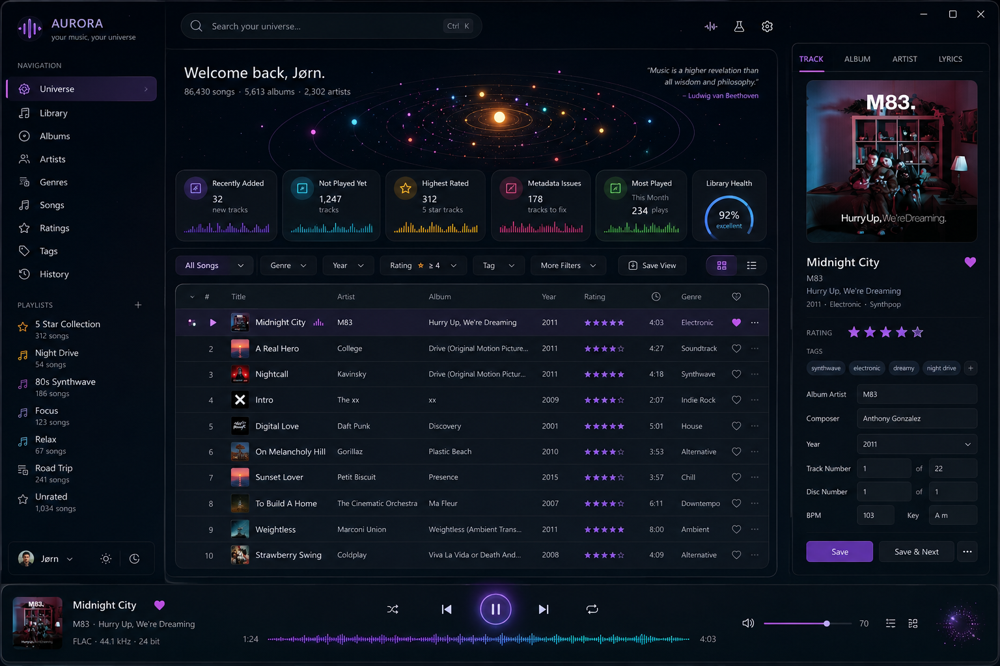

# Aurora

Aurora is a fast, local-first Windows 11 explorer and player for a personal music universe. Version 0.18.6 keeps the Album Auto-Tagger's apply and rename actions visible inside the dialog.



## Current 0.18.6 slice

- Tauri 2, Rust, React, TypeScript, and Vite Windows application.
- The Album Auto-Tagger keeps its Rename after tagging, Cancel, and Apply & rename footer visible while release and track results scroll within the available dialog height.
- Whole-album Tags saves immediately project the verified Album, Album Artist, Year, Release Year, Genre, and Publisher values into both the Album card and Album Detail. Partial or mixed track results never overwrite an album summary by guesswork.
- Album covers use five compact text lines: title, artist, `Year — Genre — Publisher`, `track count — album length`, and Album Rating/Score. Album Detail presents Genre and Publisher together with explicit unknown-value fallbacks.
- A dedicated **Inbox** between Universe and Observatory. Up to ten device-local folders are scanned every 15 seconds and whenever Aurora regains focus; folders containing MP3s become staged albums without entering the Music Library catalog.
- Inbox album rows and the selected-album inspector show the embedded image from the first sorted track. Aurora reads no other track for artwork, serves bounded WebP thumbnails through its local cover protocol, and falls back to the existing disc mark when track 1 has no usable image.
- Inbox readiness reports missing or inconsistent album identity, track titles, track/disc numbering, genre, and publisher context before promotion. `Ctrl+Shift+T` opens a dense Album Auto-Tagger that searches concrete MusicBrainz and Discogs releases, compares their track lists, allows per-field inclusion and manual Genre/title correction, and applies one verified album batch. Background Inbox rescans preserve the open tagger's selected release and comparison state.
- Auto-Tagger renaming is enabled by default for a full album, and `Ctrl+R` applies the same rename rules to manually tagged Inbox albums. Album folders become `Album Artist - Album (Year)`; tracks become `Disc-01 - Artist - Title.mp3` when a disc tag exists or `01 - Artist - Title.mp3` when it does not. Inbox track checkboxes can scope Auto-Tagger to one CD at a time, with Disc # and total overrides for separate CD1/CD2 releases. Windows-invalid characters and collisions are handled safely, and Discogs vinyl positions such as A1/A2/B1 are normalized to continuous 01/02/03 numbering.
- MusicBrainz requests use Aurora's identifying User-Agent and a process-wide one-request-per-second gate. Discogs accepts either a personal access token or a consumer key plus secret stored only in the operating-system credential vault; saved values are never returned to React or written to Aurora JSON/SQLite state. Debug builds may read `DISCOGS` and `DISCOGS_SECRET` (or `DISCOGS_TOKEN`) from the ignored `.env.local` for local endpoint testing.
- Inbox tag writes stay outside the catalog workflow: Rust canonicalizes every selected album path, stages same-folder MP3 copies, verifies parsed tags and the post-ID3 audio SHA-256, creates safety backups, installs atomically, and restores earlier tracks if a later write fails.
- **Move to library** reuses Add Music's exact preview/apply bridge and its General, Scores, and Synthwave roots. Music Library remains the sole filesystem mover and catalog writer; Inbox albums disappear from staging only after that reviewed bridge operation completes.
- Ratings **Play unrated tracks** scopes pending-deletion reconciliation to the selected album instead of rescanning the million-track catalog for every pending Music Library target before playback.
- Rust's strict warning-as-error CI lint passes for the optimized album snapshot path without changing its deletion projection or runtime behavior.
- Album detail reads pending deletion state once, scopes missing-file verification to the selected album, and reuses that result for its rows, rating, Love, duration, and track counts. It never runs Ratings' global deletion scan or opens the state database once per track during an ordinary album open.
- Album detail reads Aurora's local pending-deletion queue before checking an MP3 path, so ordinary album opens avoid synchronous probes across sleeping, remote, or unavailable music drives while queued-and-missing deleted tracks remain hidden.
- Albums detail refreshes its selected track rows after a synchronized Tags save, so the displayed per-track Artist credit matches both the verified MP3 and the tag editor without collapsing the selected album.
- Universe's compact Listening Memory strip shows the last-heard song's exact per-track Artist credit, album title, and small cover image, with historical metadata retained when its live catalog track cannot be resolved.
- Ratings completion counts, **Finish what you love** shelves and details, rating-band totals, and **Play unrated tracks** queues exclude verified-missing MP3s covered by Aurora's durable Music Library synchronization queue. An album whose only unrated track was deleted becomes complete immediately instead of retaining an unplayable card.
- Inline rating, Love, and Release Year updates refresh only those tag fields in the native playback queue, so a later star click cannot restore stale Artist, title, album, or other metadata after a vertical Tags editor save.
- Album and Ratings album-detail track lists show the exact per-track Artist credit as a muted, MusicBee-style suffix beside the title. `DISPLAY ARTIST` overrides remain preferred, so Various Artists compilations identify every performer without sacrificing the compact album layout.
- Album detail supports standard click, Ctrl+click, and Shift+click track selection, a bulk **Delete selected** action, and an explicit permanent-deletion confirmation. Aurora re-resolves every bounded catalog identity before deleting only regular MP3 files, durably queues the exact affected files, and asks Music Library to rescan immediately so its catalog and Updates deletion count reflect the removed tracks. While a failed or locked bridge update remains queued, stale catalog reads cannot restore a verified-missing deleted row, and whole-album Tags safely excludes only that queued missing file.
- A top-bar **Add music** workflow for one already-tagged album folder or a parent containing many album folders. Choose General music, Movie / TV / game music, or Synthwave; preview every unchanged folder name and exact destination in a bounded, keyboard-scrollable plan before one explicit batch apply. Apply closes the modal and continues under a persistent top-bar status so browsing and playback remain available; the intake action stays disabled until completion, and a synchronous guard prevents duplicate requests. Music Library `0.144.5` then runs its cover-archive/embedded-art workflow only for the added albums, writing embedded front art to the configured `AlbumCovers` folder without a manual full-library Cover add.
- A dedicated **Tags** tab in the right inspector for Album Artist, Artist, Album, Track Title, Genre, Publisher, Track Rating, Year, Release Year, track number/total, and disc number/total.
- Player stars, global rating/Love shortcuts, inline edits, inspector saves, and undo no longer queue behind slow Music Library bridge work. Background reconciliation reserves an older projection token before it starts and conditionally updates only the exact pending-overlay revision it inspected, so foreground changes appear promptly and always win stale-result races.
- The playbar and Track inspector prefer the selected track's Artist credit, and the Artist tab follows that credit instead of the album-level Album Artist. Track Publisher and Artist metadata remain available through library snapshots, restored queues, and specialized Genres, Publishers, Years, Ratings, and Charts playback routes.
- Track and album selection semantics model MusicBee's vertical editor: common values are shown once, differing values are labelled **Mixed**, and only checked or edited fields are written. A checked blank value is an explicit clear except for Album Artist, Album, and Track Title, which Music Library requires for safe catalog identity.
- Artist edits MusicBee's `DISPLAY ARTIST` override while preserving the underlying multi-value performer credits; Album Artist retains semicolon-separated multi-value `TPE2` credits.
- Album saves preflight every selected MP3 and its revision before the first write. Aurora then performs verified same-folder atomic writes, rolls back earlier completed files if a later file fails, and retains recovery evidence for ambiguous Windows replacement failures.
- Aurora invokes Music Library `0.144.2` or newer through a versioned, file-based local bridge. Music Library remains the sole filesystem mover and catalog writer; Aurora never opens the shared catalog for writes.
- After a verified inline, inspector, global-shortcut, or undo tag edit, Aurora durably queues the exact MP3 and returns the interaction result without waiting for Music Library. The focused background retry asks Music Library `0.144.2` to scan only that file for an ordinary rating, Love/Ban, or Release Year edit, then applies a guarded album-only transaction; broader identity or text edits and multiple pending files in one album retain the safe complete-folder/full-catalog fallback. Aurora first requires the companion's explicit legacy-`Default` POPM preservation capability, so an older helper leaves the durable update pending instead of rebuilding an album unsafely.
- Folder synchronization and Add Music intake share one bridge coordinator, so preview or apply waits behind active background work instead of racing Music Library's Windows workflow lock. Folder synchronization is token-protected: one invalid old folder cannot poison a new edit, an older receipt cannot erase a newer edit queued for the same folder, and neither a delayed edit response nor external-tag reconciliation can project over newer tag state. Pending overlays are reconciled per live track, so a targeted album import does not hide edits still awaiting synchronization in another album. While Aurora is focused it retries one pending folder every five seconds, pauses that folder after three consecutive failures, and resets its retry budget when a later MP3 edit queues new work; the Ratings completion shelf deliberately waits for its explicit Refresh action.
- The top-bar Add Music flow still assumes already-prepared folders. Identification and metadata preparation now live deliberately in Inbox; Aurora does not perform audio-fingerprint matching.
- Native folder selection, strict bridge/category/receipt validation, bounded helper timeouts, and clear update guidance when the installed Music Library does not yet support album intake. Source paths are passed in private request files rather than command-line arguments, and post-edit bridge work never blocks the rating or tag interaction that queued it.
- Truthful batch completion distinguishes fully moved albums from verified catalog copies whose source cleanup needs attention. A successful import triggers Aurora's existing revision check, stable queue rebind, and bounded view refresh immediately.
- A lightweight completed-import revision check every five seconds and whenever Aurora regains focus remains as a fallback. Its opaque completion-order token changes even when imports finish out of ID order. Successful edit and recovery receipts request the same guarded catalog refresh immediately. Queue rebinding and the base view each use one consistent SQLite read snapshot, and Aurora refreshes only after their reported revisions match the detected completed import. Stable normalized path keys keep replaced catalog row IDs from becoming playback identity.
- Catalog refreshes preserve the playing source, current track, and preloaded successor when stable queue order is unchanged. Removed queue entries are dropped; a removed current track stops safely and selects the next surviving entry in a paused state.
- Import-time rating/tag completions update only tag fields on the freshly rebound queue row, selected tracks follow their stable file key, and an unsaved inspector draft remains mounted across transient catalog-ID changes.
- Device-local Windows output selection using stable endpoint IDs, with automatic continuation on the Windows default when the preferred device is missing, cannot open, or disconnects.
- A two-entry, signature-checked encoded-MP3 read-ahead cache loads ordinary current and prepared-next tracks sequentially before the real-time callback can request them. Files above the 96 MiB admission cap or allocation failures retain a 1 MiB buffered-file fallback.
- ReplayGain Off, Track, and Album modes based on MusicBee-compatible `REPLAYGAIN_*` ID3 text frames. Album mode falls back to Track tags, positive gain is capped by the tagged peak, and MP3 files are never modified.
- One stable shared Windows output stream at the endpoint format, with CPAL real-time callback scheduling and a stability-focused 4,096-frame device buffer. Dedicated producer threads decode, apply ReplayGain, and run Rodio's balanced Rubato sinc/FFT resampler into per-track lock-free PCM rings holding at most three seconds; playback pre-fills up to 500 ms and reports observed starvation, device underruns, or denied real-time scheduling in the player output readout.
- Gapless-capable queue transitions: Aurora opens and appends the next resolved MP3 to the same native player during the final 15 seconds, so audio handoff does not wait for React polling. Missing, invalid, or unknown-duration files retain the safe ordinary transition.
- An Audio Settings tab beside Global Shortcuts, atomic per-computer persistence in `%APPDATA%\com.soundtrackgeek.aurora\aurora-audio.json`, and a compact player readout for the active output and applied gain.
- A Windows media session for physical Play/Pause, Stop, Previous, and Next keyboard buttons, with native now-playing metadata and Windows arbitration between active players. This is independent of audio shared/exclusive mode.
- Windows global shortcuts for play/pause, next, whole-star ratings 0–5, and Love. The rating defaults use `Ctrl+Alt+Numpad0` through `Ctrl+Alt+Numpad5` so number-row AltGr characters remain available; playback, next, and Love remain `Ctrl+Alt+P`, `Ctrl+Alt+N`, and `Ctrl+Alt+L`.
- A native Settings editor that captures replacement key combinations, rejects duplicates and modifierless keys, restores defaults, and enables or disables the complete shortcut set.
- A Display Settings tab with global Compact through Maximum text presets, readable minimum sizes, and Compact through Extra Large library-cover presets.
- Independent text and cover overrides for Universe, every Library destination, Observatory, Charts, and History. Views inherit the global choices until explicitly overridden; Charts starts at the larger text preset, and cover controls are disabled where a view has no adjustable artwork.
- Device-local display preferences in versioned browser storage, restored before Aurora renders and kept outside MP3s, the read-only catalog, and shared OneDrive state.
- Shortcut actions always resolve Aurora's now-playing track from the Rust playback runtime. Explore selection never becomes the rating or Love target, and tag shortcuts return after the same verified MP3 plus optimistic Aurora-state update as the player while catalog synchronization continues in the background.
- Device-local shortcut persistence in `%APPDATA%\com.soundtrackgeek.aurora\aurora-shortcuts.json`; these Windows bindings are intentionally excluded from Laptop Mode and OneDrive state synchronization.
- Aurora unregisters all active shortcuts during both window close and application exit. Another running app must still retry or restart if its own registration previously failed while Aurora owned the same binding.
- A persistent left-sidebar cycle with expanded, icon-only, and fully collapsed modes, plus an independently collapsible right inspector. Layout choices stay local to each computer and restore before the first rendered frame.
- A separate device-local **last view** snapshot restores the active destination, explorer mode, exact search and filter expression, sort direction, right-inspector section, and selected album context after quitting and reopening Aurora. Invalid or obsolete snapshots fall back safely to Universe.
- A collapsible Library tree containing Songs, Albums, Artists, Publishers, Genres, Years, Ratings, and Tags. Opening a closed Library enters Songs by default; Library and Playlists disclosure choices persist per computer.
- A dedicated Publisher Signal Timeline with bounded case-insensitive catalog rollups, Release activity, Original-year activity, and Catalog share lenses, publisher search, selected-publisher metrics, decade highlights, publisher playback, and exact handoff into a publisher-filtered Albums collection. Every signal uses its activity years on the same responsive axis, including the final 2026 interval.
- Publisher metadata in Songs, Albums, Genre, Years, Ratings, Publishers, and the right-side track or album inspector. Album-level views read `albums.publisher`; track views retain `tracks.publisher` without schema mutation.
- Offline-safe publisher identity slots use distinctive deterministic Aurora monograms. A selected publisher can use a bounded device-local PNG, JPEG, or WebP override and return to its generated monogram at any time; optional future enrichment retains the documented MusicBrainz → Wikidata → Wikimedia Commons provenance and licensing route.
- Compact Library and pinned-playlist flyouts in icon-only mode, with active nested destinations still visible on the parent Library icon.
- A paired-clock Years explorer that preserves Music Library's distinct Original Year and Release Year fields, with clickable album-level histograms and aggregated edition flows between them.
- Release, Original, and Two Clocks modes; exact missing-year lenses; previous/next year movement; and bounded edition shelves grouped by the counterpart decade.
- A dedicated Album inspector for selected editions, exact Original/Release Year handoff into Songs, and bounded year or album playback without exposing file paths to React.
- Lazy, stale-safe Years queries: overview payloads contain roughly one row per year, year details return at most 100 representative albums, and playback returns at most 100 tracks.
- A dedicated Ratings Studio with separate track and effective-album constellations, clickable whole- and half-star bands, an exact 5 Star Collection, and tall real-cover pyramids with a silver-to-magenta constellation palette.
- Selected albums in Ratings completion details include a **Go to Album** action that opens Albums with that exact album selected, even when it is outside the first album page.
- Almost Complete, Partially Rated, and Unrated Album lanes with mutually exclusive catalog counts, at most 14 album candidates per request, bounded track details, and Play Unrated Tracks.
- Ratings completion details respond to the available content-pane width, keeping the cover and album metadata together above the track list while placing Play Unrated Tracks beneath large cover art.
- Music Library-compatible effective album ratings: explicit MusicBee Album Rating wins; otherwise a rounded normalized track mean becomes valid only after every track is rated. Partial means are labelled provisional and never enter album-rating counts.
- Music Library's exact unbounded Album Score formula, kept numeric rather than converted to stars. Fully track-rated albums show the current score in Ratings and ordinary Album detail; future Charts can rank by the same value without changing its meaning.
- A dedicated Charts page above History with Singles and Albums modes, direct weekly drill-down, named period presets, editable custom week ranges, and one-click full-year charts.
- Historical Official UK, VG Lista, Ti i Skuddet, and Norsktoppen weekly charts plus the catalog's annual Billboard singles and album charts. Unsupported source/type combinations are never presented as data.
- Calculated period charts rank by number of #1 finishes, then #2 finishes, then each lower position in order; chart points and appearances provide deterministic final tie-breaks.
- A first-class Aurora Album Score chart and year shelf reuse Music Library's exact numeric formula without converting it to stars, use `Year` by default, and can switch explicitly to `Release Year`.
- Library-matched chart entries expose real cover art, rating, Love, movement, peak, source history, direct playback, chart-queue playback, and handoff into the ordinary library inspector. Requests and playback queues remain capped at 100 items.
- Instant Ratings Studio star and Love controls reuse the verified MP3 transaction and Aurora overlay while keeping the visible completion candidates stable. The explicit Refresh action reloads the Ratings overview and completion shelf when the rating pass is finished; switching completion lanes still avoids rerunning the full overview.
- Persistent icon-only device mode: a monitor identifies Desktop Mode, a laptop identifies Laptop Mode, and each computer remembers its own choice in `aurora-device.json` outside the shared state database.
- Exact runtime-only drive translation from `D:\MUSIC`, `G:\_BACKUP\SCORES`, and `H:\Synthwave` to `Y:\MUSIC`, `V:\_BACKUP\SCORES`, and `U:\Synthwave`; the catalog and stable track identities remain unchanged.
- Verified SQLite state snapshots at `%USERPROFILE%\OneDrive\_musicbackup\aurora-state.sqlite3`, published at most once per minute and once more on clean shutdown.
- Per-device listening journals in local `aurora-history.sqlite3` databases, mirrored as separately named, validated OneDrive snapshots so Desktop and Laptop sessions can be combined without creating shared-state conflicts.
- A configurable 1–3600 second played threshold, defaulting to 30 seconds. Only observed forward playback counts; seeking does not inflate listening time, a shorter track counts when it naturally finishes, and active listening is checkpointed in 30-second buckets rather than every 10 seconds.
- A bounded History timeline with outcome, device, date, and text filters; registered-play, listening-time, unique-track, skip, and most-played summaries; and direct replay/inspection actions.
- Personal registered plays, listening time, and last-listened time in the selected-track inspector, kept distinct from imported Last.fm popularity.
- First-run laptop recovery copies a valid OneDrive snapshot into Aurora app data before SQLite opens. Newer clean snapshots are also applied only before open, with a retained local safety copy.
- Sync lineage, generations, and logical revisions detect two-computer divergence. Aurora reports a conflict and preserves both files instead of using unsafe newest-file-wins behavior.
- Equivalent OneDrive branches reconcile automatically when only transient catalog IDs, playback position, import-run markers, or retry timestamps differ. Stable queue identity and user-authored tag, journal, playback-setting, and curation differences still block automatic replacement.
- Strictly read-only access to `%APPDATA%\com.local.musiclibrary\music-library.sqlite3`.
- A dedicated Genre Atlas over all canonical catalog genres, with search and sorts for scale, rating, Love, recent listening, unexplored worlds, and name.
- Bounded genre details with representative album covers, `Year` decades, personal listening memory, top albums and artists, shared-artist connections, and editable track highlights.
- Genre Radio, Shuffle, Loved, Highest Rated, Rediscover, and Unrated Expedition actions that load at most 100 tracks per batch, auto-refill below 20 remaining tracks, and never exceed the 200-track queue.
- Bounded startup payload: summary, eight high-volume artists, and 50 five-star tracks.
- Keyset-paged Tracks, Albums, and Artists views that request 50 rows at a time and never hold a million-row result in the WebView.
- The top search reports the exact filtered Songs, Albums, or Artists total even when only the current 50-row page is loaded.
- Songs, Albums, and Artists keep a compact Sort and Reset row while catalog filtering happens through the persistent top search. Songs and Albums can sort by when they were added. Successful Add Music batches record a durable, synchronized album-added timestamp; older albums fall back to the newest catalog track's insertion order. The active sort remains an enabled menu choice, so re-selecting it always reverses newest/oldest or A–Z/Z–A direction even after moving across other choices. Existing collection handoffs can still apply exact rating, Love, year, genre, and artist scopes, and Reset clears them.
- Field-aware search supports `artist:` (Display Artist), `aartist:` (Album Artist display), `album:`, `genre:`, `year:` (Year), `ryear:` (Release Year), `publisher:`, and `title:`. Year fields accept exact years and inclusive closed or open ranges such as `year:1985..1987`, `year:1985..`, and `ryear:..1987`. Commas or uppercase `AND` combine groups; uppercase `OR` adds alternatives and inherits the preceding field; `NOT` or a leading `-` excludes a group. A complete quoted value is exact, while unquoted text remains prefix-based. `genre:scores` expands to the Music Library film, TV, animation, anime, and game-score genres.
- Validated sorts for newest, title, artist, album, year, release year, rating, and artist track count; opaque cursors cannot be reused with a different sort.
- Clickable artist planets open an exact artist focus in Songs, while artist results open the artist's Albums by default; both retain an exact artist scope that can be switched between Songs and Albums.
- A functional Constellations artist inspector opened from universe planets, Artist results, the selected track, or the Observatory review queue.
- A bounded, searchable Observatory for candidate-bearing artists, with Needs review, Conflicts, Unconfirmed, Aurora decisions, and All candidates filters.
- Explicit artist candidate confirmation, ignore, and clear actions. Aurora decisions are durable, undoable, and take presentation precedence without hiding disagreements in the imported sources.
- Local release-group curation for linking a visible MusicBrainz group to an album from the same artist, marking it not in scope, ignoring it, or clearing the decision.
- Lazy local MusicBrainz identity resolution with verified, unconfirmed, conflict, ignored, and unmatched states; verified external overlay links and explicit Aurora confirmations are labeled with their exact provenance.
- MBID-gated artist type, active dates, area, birthplace, and origin-country context from the existing catalog import.
- Source-precedence release-group discographies capped at 100 rows: curated overlay first for verified identities, catalog mirror fallback, then the broad cache without mixing stale and refreshed sources.
- Visible local provenance and source availability for the catalog, curated overlay, and broad cache; missing optional databases never block normal library browsing.
- Explicit overlay export creates a new, complete Music Library-compatible SQLite snapshot in Aurora's app-data `exports` folder. Aurora never mutates the live shared overlay; publishing the exported file remains a deliberate user step.
- Album cover grids with a MusicBee-style inline track panel directly beneath the selected cover row. Clicking the same cover or the close control collapses the panel without replacing the grid or losing the browsing position.
- Every album card and expanded detail shows the stored effective Album Rating as five stars with half-star support alongside the numeric Album Score. The currently playing track has its own animated left signal, independent from the selected row used for inspection or editing.
- Bounded album track details retain playback activation, keyboard row navigation, inline tag controls, and a right inspector whose Album, Track, and Artist tabs stay scoped to the selected album.
- A vertical multi-file inspector tag editor plus existing inline half-star rating and Love/Neutral/Ban controls, with read-only duration and optional Last.fm popularity in the Track view.
- Direct Explore-row rating and Love controls: click either half of a star for an exact 0.5 step or click the heart to toggle Love, and Aurora saves to the MP3 immediately with per-row verification feedback.
- Native MP3 playback with play/pause, seek, previous/next, volume, shuffle, and repeat-one/repeat-all controls.
- A real MP3-derived, purple-to-cyan waveform timeline. Native builds decode every audio frame into a 640-peak whole-song overview, cache it in device-local `aurora-waveforms.sqlite3`, and never accept an arbitrary WebView path. The continuous envelope distinguishes played from upcoming audio and remains directly seekable. Cache misses use one cancellable sequential decode slot, so rapid skips do not multiply competing analysis jobs; older 320-peak sparse cache entries are discarded automatically.
- Race-safe seeking and a local player clock: the exact released range value is committed, older overlapping seek responses cannot replace newer state, and the progress line continues at 250 ms cadence between two-second native snapshots.
- Bottom-player half-star rating (including clear-to-unrated) and Love controls that reuse Aurora's verified instant MP3 tag-write and optimistic state-overlay workflow.
- A clickable end-time readout that toggles between total duration and a live negative remaining-time display.
- A bounded 200-track queue with play-now, reorder, remove, and clear actions.
- Durable queue, current track, position, volume, shuffle, and repeat state in Aurora's own SQLite database.
- Stable queue identity based on the normalized MP3 path, verified alongside every transient track ID so queue items survive Music Library catalog imports without being retargeted.
- Transactional same-folder MP3 writes using standard ID3 text/position frames, MusicBee's exact POPM byte map, legacy whole-star `Default` POPM fallback, `LOVE RATING`, Release Time, and existing `DISPLAY ARTIST` conventions. A rating edit replaces either recognized owner with one canonical `MusicBee` frame while preserving unrelated POPM owners.
- Conflict detection, post-write tag/audio verification, Windows atomic replacement, and crash recovery. Original backups remain available while a single-file or album operation is in progress, then are deleted after the complete operation verifies; ambiguous or failed recovery files remain untouched for manual recovery.
- Aurora-owned tag overlays update rating, Love, and Release Year immediately while the verified save asks Music Library to reimport the existing album folder. The normal catalog-revision watcher then refreshes every affected view.
- Focus-time reconciliation remains as a recovery path for pending overlays: it reads only bounded pending MP3s, treats their tags as authoritative, clears caught-up overlays, and rotates unavailable files so they cannot starve later work.
- Half-star track reconciliation reads Music Library's raw rating when its older normalized field is null; removed-track overlays are excluded from library totals.
- Album covers served through a narrow Rust protocol that resolves exact album IDs, contains canonical paths to the configured archive, rejects oversized sources, and caches 64–512 px WebP thumbnails.
- Packaged-app update checks at startup and every 60 seconds, with an Aurora-styled install prompt.
- Windows NSIS release workflow with mandatory Tauri updater signatures.

The MP3 is authoritative for Aurora tag edits. Aurora never writes the shared Music Library SQLite database; the companion performs a guarded existing-folder reimport after verified saves, while Aurora's private overlay covers the short interval before the catalog catches up. Aurora's MusicBrainz decisions are stored in Aurora's app-owned database, but they are independent of MP3 tags and the imported catalog. Listening events deliberately use a separate per-device database instead of the single shared state snapshot. All OneDrive copies are consistent SQLite snapshots rather than copies of live WAL-backed files. See [docs/audio-output-contract.md](docs/audio-output-contract.md), [docs/charts-contract.md](docs/charts-contract.md), [docs/genre-atlas-contract.md](docs/genre-atlas-contract.md), [docs/global-shortcuts-contract.md](docs/global-shortcuts-contract.md), [docs/inbox-contract.md](docs/inbox-contract.md), [docs/listening-history-contract.md](docs/listening-history-contract.md), [docs/laptop-mode-contract.md](docs/laptop-mode-contract.md), [docs/publisher-logos.md](docs/publisher-logos.md), [docs/ratings-studio-contract.md](docs/ratings-studio-contract.md), [docs/sidebar-navigation-contract.md](docs/sidebar-navigation-contract.md), [docs/tag-editing-contract.md](docs/tag-editing-contract.md), [docs/musicbee-tags.md](docs/musicbee-tags.md), [docs/playback-contract.md](docs/playback-contract.md), and [docs/years-explorer-contract.md](docs/years-explorer-contract.md).

## Data model

The primary catalog currently contains 1,096,288 MP3 tracks, 72,012 albums, and approximately 20,000 album artists across 687 canonical genres. Of those albums, 12,434 have an effective album rating, 678 need only 1–3 more track ratings, 5,723 are partially rated, and 59,578 are unrated. The live full Ratings overview, including overlay-aware album recalculation and bounded shelves, measured about 1.7 seconds; completion-lane changes reuse that overview. Aurora opens the active WAL-backed database with SQLite read-only flags and `query_only`; it does not use immutable mode and does not write ratings back into this imported catalog. Common bounded explorer paths remain approximately 26–84 ms including SQLite process startup. Global title A–Z is the known slower path at approximately 120 ms because the shared catalog has no title-only index.

The broad MusicBrainz cache and curated overlay are deferred from startup and opened independently only when the Artist inspector or Observatory requests context. The audited cache contains 20,208 artist-name rows and 483,675 release groups; the curated overlay contains 493 verified artist links and 9,658 release groups. Cache-only identities remain unconfirmed because 44 audited exact-name candidates conflict with verified links and many MBIDs are shared by multiple names. Observatory pages are capped at 100 rows and intentionally cover candidate-bearing artists already present in the imported MusicBrainz artist-info table; they are not a claim to enumerate all 20,392 catalog artists. See [docs/database-contract.md](docs/database-contract.md) for verified responsibilities, limits, and authority rules.

The album-cover archive at `C:\_code\music_backup_v5\AlbumCovers` contains 76,329 images and maps to current albums through `album_covers.album_id` with 98.09% coverage. Rust now resolves and decodes those images outside the WebView; missing or invalid art falls back to Aurora's generated artwork.

## Requirements

- Windows 11 with WebView2
- Node.js 22+
- Rust stable with the MSVC target and Windows C++ build tools
- The music catalog at the default `%APPDATA%` path above
- Music Library `0.144.2` or newer installed at `%LOCALAPPDATA%\Music Library\music-library.exe` for album intake and background post-edit catalog synchronization
- The referenced MP3 files and album-cover archive mounted at their cataloged paths for playback and real artwork
- For Laptop Mode, the equivalent library roots mounted at `Y:\MUSIC`, `V:\_BACKUP\SCORES`, and `U:\Synthwave`
- A locally available `%USERPROFILE%\OneDrive\_musicbackup` directory for Aurora state and per-device history mirroring; catalog browsing and local history still work and report a sync warning when it is unavailable
- Optional local MusicBrainz sources under `%USERPROFILE%\OneDrive\_musicbackup` for Constellations enrichment; Aurora remains usable when either source is missing

## Develop and verify

```powershell
npm ci
npm run check:version
npm run lint
npm test
npm run build
cargo fmt --manifest-path src-tauri/Cargo.toml --all -- --check
cargo clippy --manifest-path src-tauri/Cargo.toml --all-targets -- -D warnings
cargo test --manifest-path src-tauri/Cargo.toml
npm run tauri -- dev
```

Browser development uses clearly labelled preview records and serves matching read-only artwork directly from the configured local cover archive. Prefer the Browser plugin for UI testing and visual inspection; reserve Computer Use for native-only behavior that Browser cannot exercise. Only the Tauri runtime exercises the real SQLite and verified MP3-write boundaries.

Build a local NSIS installer with:

```powershell
npm run tauri -- build
```

## Releases and in-app updates

Every successful push to `master` runs verification first, then builds a Windows NSIS setup executable, signs the updater artifact, creates the matching SemVer tag and GitHub Release, and uploads `latest.json`. The workflow can also be started manually to retry publication of the current version.

Before pushing a new version:

1. Update every manifest, lockfile, and user-facing version label to the same version.
2. Move the relevant changelog notes from `Unreleased` into a dated version section.
3. Run `npm run check:version` and the full verification commands above.
4. Commit and push to `master`. CI verifies and publishes the release autonomously; no manual tag or post-push monitoring is required.

The repository already has `TAURI_SIGNING_PRIVATE_KEY` and `TAURI_SIGNING_PRIVATE_KEY_PASSWORD` Actions secrets. The local encrypted key material is under `%USERPROFILE%\.tauri`:

- `aurora-updater.key` — encrypted private updater key
- `aurora-updater.key.pub` — public updater key
- `aurora-updater-password.dpapi.xml` — passphrase protected for the current Windows account

Back up the private key and passphrase separately and securely. Losing either prevents installed Aurora copies from accepting future updates. This updater signature proves artifact integrity; it is separate from optional Windows Authenticode signing, so installers may still show an Unknown publisher/SmartScreen warning.

## Architecture brief

The behavioral scope, performance target, source-of-truth decisions, and next sections are captured in [docs/app-brief.md](docs/app-brief.md).
